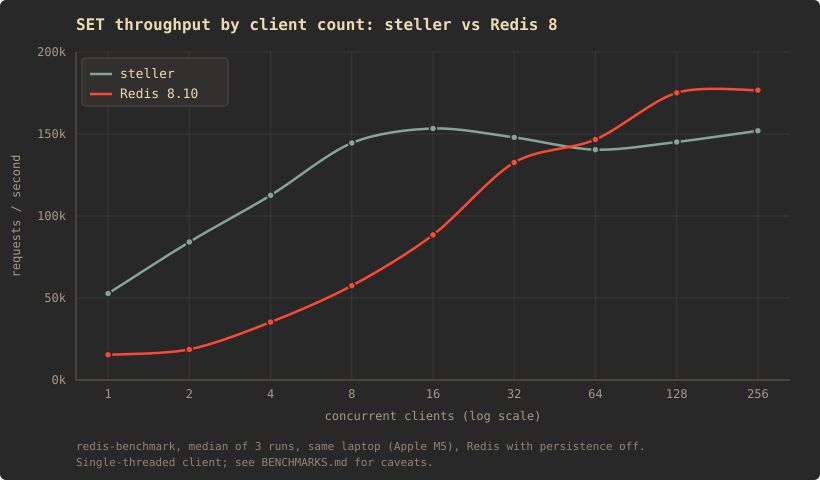

# Benchmarks

`redis-benchmark` driving steller and a real Redis on the same machine, alternating between them at each client count. The point is not to beat Redis. It is to put numbers on the design (a thread per connection around one mutex, no async runtime) and to find out where it stops working.

## Setup

- Apple M5, 10 cores, 24 GB, macOS 26.6.2. Client and both servers on this one machine, nothing pinned.
- steller: `cargo build --release`, rustc 1.97.1 (8bab26f4f 2026-07-14).
- Redis 8.10.1 from Homebrew, `redis-server --port 3001 --save "" --appendonly no`. steller keeps its AOF on, so persistence is not equal between them; it is on for the one that has it.
- `redis-benchmark 8.10.1`. Each cell is the median of three runs unless noted. `-n 50000` below 64 clients, `-n 100000` at and above. Latency columns are from `--csv`.
- Ephemeral port exhaustion and TIME_WAIT were drained between runs (the run at 1,000 clients still lost one repetition to it).

## Results



Throughput in requests per second, latency in milliseconds.

| clients | steller SET | p50 | p99 | Redis SET | p50 | p99 | steller GET | Redis GET |
| ---: | ---: | ---: | ---: | ---: | ---: | ---: | ---: | ---: |
| 1 | 52,743 | 0.02 | 0.02 | 15,380 | 0.06 | 0.08 | 53,763 | 14,997 |
| 2 | 84,175 | 0.02 | 0.05 | 18,657 | 0.10 | 0.13 | 86,655 | 19,616 |
| 4 | 112,613 | 0.03 | 0.06 | 35,286 | 0.11 | 0.14 | 104,822 | 37,793 |
| 8 | 144,509 | 0.05 | 0.08 | 57,471 | 0.13 | 0.17 | 131,234 | 65,274 |
| 16 | 153,374 | 0.07 | 0.11 | 88,496 | 0.16 | 0.22 | 133,333 | 98,814 |
| 32 | 147,929 | 0.13 | 0.21 | 132,626 | 0.21 | 0.29 | 136,612 | 140,845 |
| 64 | 140,449 | 0.25 | 0.35 | 146,628 | 0.35 | 0.58 | 134,771 | 169,205 |
| 128 | 145,138 | 0.46 | 0.73 | 175,131 | 0.57 | 0.82 | 137,741 | 175,747 |
| 256 | 151,976 | 0.84 | 2.24 | 176,678 | 0.88 | 1.44 | 145,985 | 185,185 |

The high end, `-n 100000`:

| clients | steller SET | p50 | p99 | Redis SET | p50 | p99 | runs |
| ---: | ---: | ---: | ---: | ---: | ---: | ---: | :-- |
| 200 | 181,159 | 0.56 | 1.66 | 217,865 | 0.57 | 1.03 | median of 3 |
| 500 | 174,825 | 1.41 | 5.61 | 205,761 | 1.27 | 5.05 | median of 3 |
| 1,000 | 165,021 | 3.00 | 9.94 | 215,542 | 2.40 | 8.12 | 2 runs; the third lost to ephemeral-port exhaustion on the client |
| 2,000 | 150,830 | 6.45 | 18.96 | 206,186 | 5.02 | 11.42 | single run |
| 4,000 | crashed (see below) | | | not run | | | |

Pipelined, one client, `-P 16 -n 200000`: steller 508,906 SET / 514,139 GET per second at p50 0.023 ms; Redis 215,750 / 244,798 at p50 0.071 / 0.063 ms.

## Reading the curve

**Below about 32 clients steller is ahead, and the reason is not processing speed.** With one client and no pipelining the benchmark sends a request, waits for the reply, sends the next, so the number is the round trip. A thread blocked in `read()` is woken by the kernel directly; an event loop has to come back around through `kqueue`, and on macOS that is slow. Pipelining removes the round trip from the measurement and Redis goes from 15k to 216k on the same connection. So the low end is wake-up latency, and it would shrink on Linux.

**Above about 32 clients Redis pulls away and steller flattens.** Every steller session takes the one cache mutex per command. Under contention the requests serialize through it and the extra threads only add scheduling. One event loop has nothing to contend with.

**Steller's pipelined number is real, though.** 510k/s with one client means the RESP parser and the cache path are not the bottleneck. The bottleneck is the lock, and only once there is someone to fight for it.

## The ceiling

At 1,000 clients steller is running 2,004 threads (a reader and a writer per connection) at 57 MB resident. Redis is at 4 threads and 22 MB.

At 4,000 clients steller died:

```
thread '<unnamed>' panicked ... failed to spawn thread: Os { code: 35, kind: WouldBlock, message: "Resource temporarily unavailable" }
```

macOS caps a process at 6,144 threads (`kern.num_taskthreads`). Two per connection puts the wall near 3,000. That is not a bug in the code; it is the design's limit, made concrete.

It came back. The crash skipped the shutdown path, replay handled the log as written, and the key set during the run read back after restart.

## What the first run found

The very first `redis-benchmark` run turned up two things no manual session could have.

**The server could not restart afterwards.** Compaction (`Aof::clear`) opened a second, non-append handle to truncate the log and then dropped the old `BufWriter`, which flushed its pending bytes at its old cursor into the now-empty file. The OS filled the gap with zeros: 8,992,628 NULs followed by 7,372 bytes of real frames, on a 9,000,000-byte log. Replay read byte 0 and refused, correctly. It only happens once more than the writer's 8 KiB buffer has gone through since the last snapshot, so nothing under about 180 SETs could trigger it. Fixed by draining the writer first and truncating through the one append-mode handle; there is a regression test that fails on the old body.

**The first request on every new connection took 49 ms.** The accept loop was non-blocking and slept 50 ms between polls. It now blocks in `accept()`, and the shutdown thread wakes it with one throwaway connection to the listener's own address. First request is now 0.2 ms.

## Caveats

- The client is single-threaded. Above roughly 64 clients it is probably the ceiling for both servers, not the servers. A `--threads` run is the next thing to do before claiming anything about the top end.
- Same machine for everything, no isolation. Absolute numbers moved by 2x between sessions on the Redis side alone. Compare the two lines, not the numbers to other people's.
- macOS. The low-client result depends on `kqueue` wake-up cost and would look different on Linux.
- The accept-loop change was not A/B'd against the old binary in the same session, so its effect on the throughput columns is not measured, only the latency fix.
- Persistence is on for steller and off for Redis.

## Reproduce

```
cargo build --release
mkdir bench && cd bench
sleep 3600 | ../target/release/steller &      # stdin must stay open; EOF is the shutdown trigger
redis-server --port 3001 --save "" --appendonly no --daemonize yes
for c in 1 2 4 8 16 32 64 128 256; do
  redis-benchmark -p 3000 -t set,get -n 50000 -c $c --csv
  redis-benchmark -p 3001 -t set,get -n 50000 -c $c --csv
done
redis-benchmark -p 3000 -t set,get -n 200000 -c 1 -P 16 -q
```

Run each three times and take the median.
